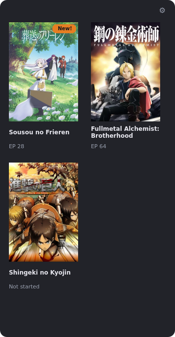

# AnimeW Widget

A minimal Linux desktop widget that tracks what you watch in **mpv** and keeps your **MyAnimeList** list in sync — automatically. It sits quietly in a corner of your screen (always-on-bottom, dark theme) and shows one card per anime with your latest watched episode.

## Features

- **mpv detection** — watches mpv over its IPC socket (supports both plain mpv and SVP4 setups out of the box) and reads exactly which file is playing.
- **Release-group aware** — tracks files whose names contain one of *your* configured release tags (e.g. the group you download from). The tag list is fully configurable — bring your own; an empty list means nothing is tracked, so random videos never touch your MAL list.
- **Pause-aware watching** — an episode only counts as watched after a configurable amount of *actual* playback time (default 10 minutes), so accidental launches and previews don't count.
- **MyAnimeList sync (official API)** — adds shows to *Watching*, raises episode progress, flips to *Completed* on the final episode, and marks earlier seasons of a franchise completed when you start a new one. **Your scores and statuses are never touched.**
- **Daily discovery** — once a day it sweeps your shows' related entries and surfaces untracked sequels/movies with a subtle "New!" badge on all cards of that franchise, plus exactly one notification per item.
- **Private by design** — everything is stored locally (SQLite). The only network traffic is to MyAnimeList's official API.

## Requirements

- Linux with X11 (developed and tested on XFCE4)
- Python 3.10+
- mpv (any recent version) — with one line added to its config (see below)
- A free MyAnimeList API client (2 minutes to create)

## Setup

1. **mpv IPC socket** — add to `~/.config/mpv/mpv.conf`:
   ```
   input-ipc-server=/tmp/mpv.sock
   ```
   (If your setup uses a different socket path — e.g. SVP4's `/tmp/mpvsocket` — that's fine: the widget tries a configurable list of sockets.)

2. **MyAnimeList API client** — create one at <https://myanimelist.net/apiconfig> (*Create New Client*). App type **Web** or **Other**; App redirect URL `http://localhost:8765/callback`; homepage URL can be your MAL profile. Keep the client ID (and secret, if given).

3. **Configuration**:
   ```bash
   cp config.example.json ~/.config/animew-widget/config.json
   # then put your client ID (+ secret) into that file
   ```

4. **Install & run**:
   ```bash
   python3 -m venv .venv
   .venv/bin/pip install -r requirements.txt
   .venv/bin/python -m animew.widget
   ```
   On first launch your browser opens for a one-time MyAnimeList authorization. After that, click the ⚙ in the corner and add your release tag(s) — the widget only tracks files whose names contain one of them.

5. *(Optional)* **Autostart** — copy the example autostart entry and adjust paths:
   ```bash
   cp animew-widget.desktop.example ~/.config/autostart/animew-widget.desktop
   ```

## Usage

- **Cards** — one per anime, showing the latest watched episode. Click a card to open its MAL page; hover for the synopsis.
- **⚙ Settings** — release tags, watched-after minutes, grid columns/rows, and card image size.
- **Right-click a card** — "Re-pick from search results…" if a title ever resolves to the wrong anime; "Dismiss 'New!' badge" if you don't care about the detected sequel/movie.
- **Right-click the panel** — Settings, re-authorize MyAnimeList, Quit.

## How it works

```
mpv (IPC socket) ──► title parser (your release tags) ──► MAL search (correct anime + episode)
                          │
                  10 min of real playback
                          │
                  local SQLite state ◄──► MyAnimeList API (two-way sync)
                          │
            widget grid + daily new-content check ("New!" badges)
```

The list mirror is pulled from MAL on every startup, and locally-watched episodes are pushed back — so manual edits on the MAL site and this widget always converge. Season markers in filenames (`S2`, `Season 2`, `2nd Season`) are handled, and ambiguous search results can be corrected with a right-click re-pick.

## Screenshot



## License

[MIT](LICENSE)
